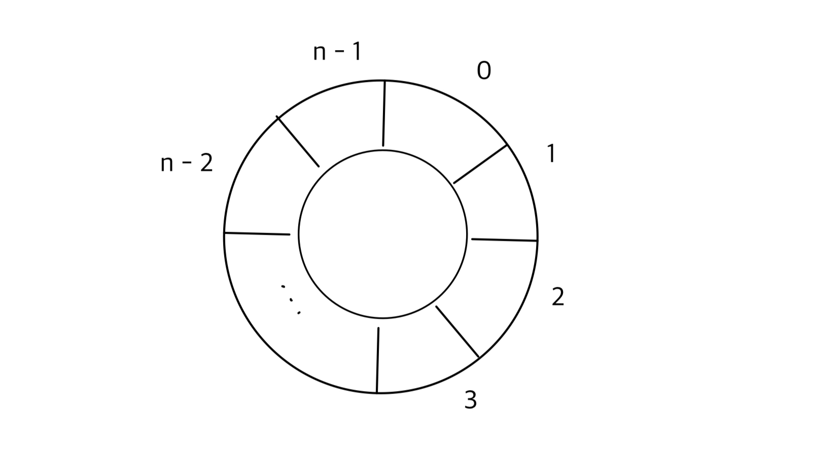
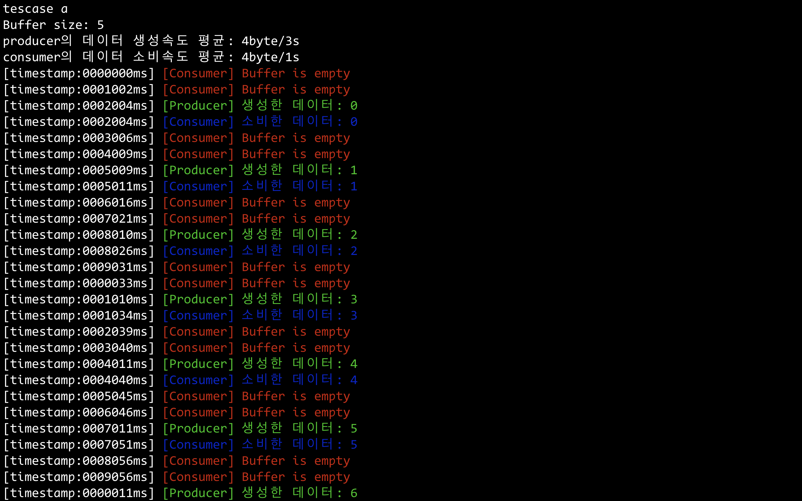
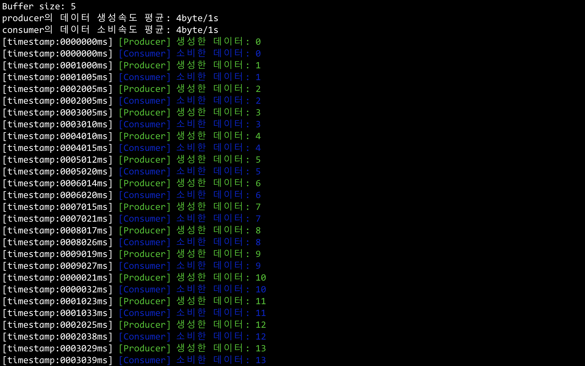
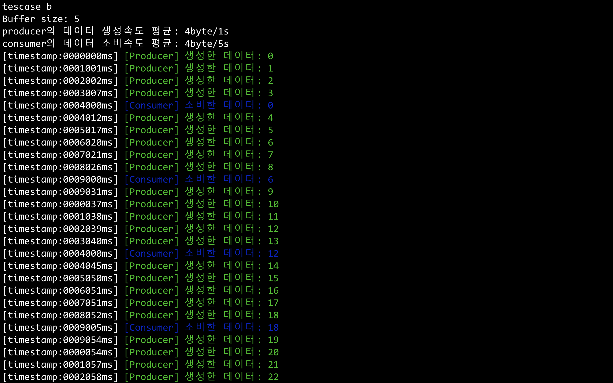

## Thread-safe Ring buffer



### Interface

* `void rtos::RingBuffer::put(int item) noexcept;`

    버퍼에 정수 data를 저장한다. 빈 공간이 없는 경우 기존의 데이터를 덮어쓴다.

* `void rtos::RingBuffer::putWithoutOverride(int item) noexcept;`

    버퍼에 정수 data를 저장한다. 빈 공간이 없는 경우 빈 공간이 생길때까지 기다린다.

* `void rtos::RingBuffer::get();`

    버퍼에서 값을 꺼낸다(FIFO). 버퍼가 비어 있는 경우 `EmptyBufferReadException` 예외를 던진다.

* `void rtos::RingBuffer::getFromNotEmptyBuffer() noexcept;`

    버퍼에서 값을 꺼낸다. 버퍼가 비어 있는 경우 값이 저장될때까지 기다린다.


### Quick start

```shell
$ make
$ ./exe <option>
```

`<option>`: `a` `b` `c` 중 하나

* `a`: 데이터 평균생성속도 < 평균처리속도

    

* `b`: 데이터 평균생성속도 = 평균처리속도

    

* `c`: 데이터 평균생성속도 > 평균처리속도

    

### simulation

Data를 생성(저장)하는 Producer thread와 data를 버퍼에서 꺼내 사용하는 Consumer thread를 사용하여 real-time system을 재현하였다.


