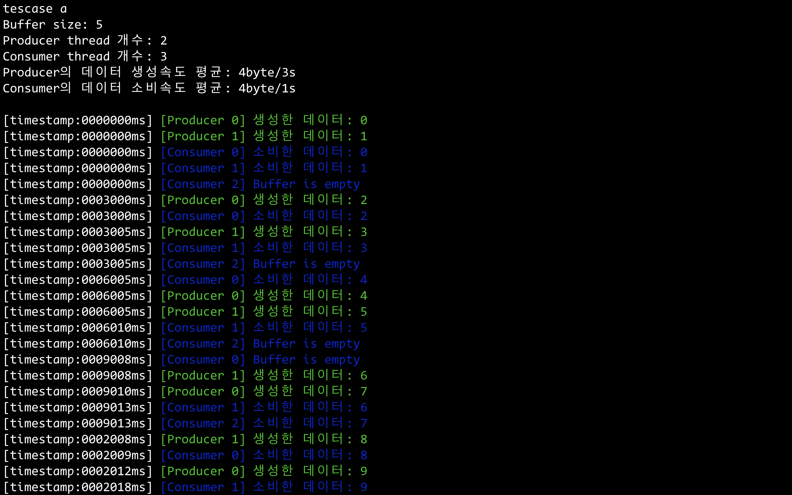
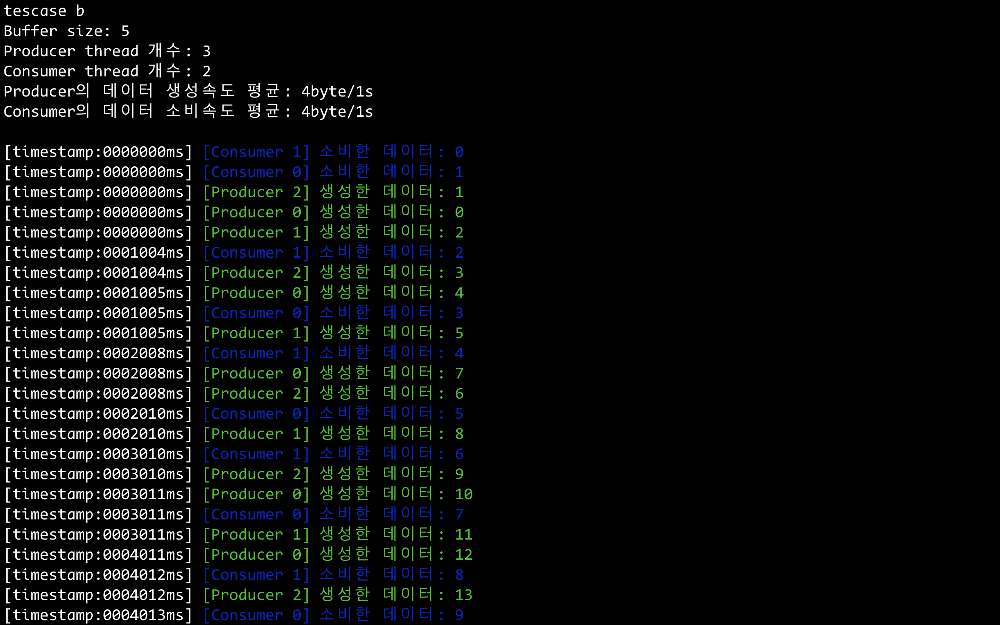
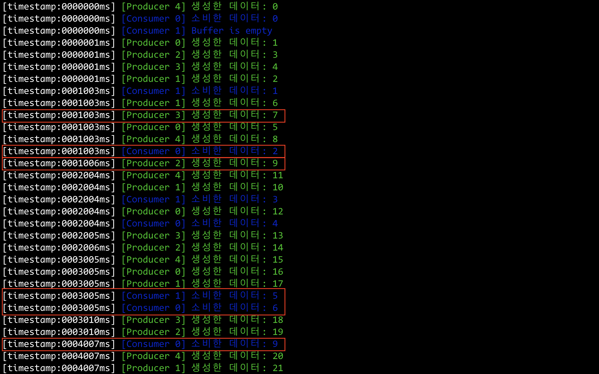

# Ring Buffer for Real-time system


## Interface

* `void rtos::RingBuffer::put(int item) noexcept;`

    버퍼에 정수 data를 저장한다. 빈 공간이 없는 경우 **새로운 데이터를 쓰지 않고 넘어간다.(no-op)**

* `void rtos::RingBuffer::putWithoutOverride(int item) noexcept;`

    버퍼에 정수 data를 저장한다. 빈 공간이 없는 경우 빈 공간이 생길때까지 기다린다.

* `void rtos::RingBuffer::get();`

    버퍼에서 값을 꺼낸다(FIFO). 버퍼가 비어 있는 경우 `EmptyBufferReadException` 예외를 던진다.

* `void rtos::RingBuffer::getFromNotEmptyBuffer() noexcept;`

    버퍼에서 값을 꺼낸다. 버퍼가 비어 있는 경우 값이 저장될때까지 기다린다.


## Simulation 실행

```shell
$ make
$ ./exe <option>
```
`<option>`: `a` `b` `c` 중 하나


* `a`: 데이터 평균생성속도 < 평균처리속도

* `b`: 데이터 평균생성속도 = 평균처리속도

* `c`: 데이터 평균생성속도 > 평균처리속도

## Simulation 결과

Data를 생성하는 Producer thread와 data를 버퍼에서 꺼내 사용하는 Consumer thread를 사용하여 real-time system을 재현하였다. 
**Producer가 생성한 데이터는 버퍼에 빈 자리가 있는 경우에만 저장된다.**

> **timestamp 값이 같은 쓰레드들의 실제 실행 순서는 출력되는 순서와 다를 수 있다.**

### case a) 평균발생속도 < 평균처리속도

테스트 조건
* `Buffer size` 5
* `Producer thread 개수` 2
* `Consumer thread 개수` 3
* `Producer가 데이터를 생성하는 평균속도` 4byte/3s
* `Consumer가 데이터를 처리하는 평균속도` 4byte/1s

결과 




### case b) 평균발생속도 = 평균처리속도

테스트 조건
* `Buffer size` 5
* `Producer thread 개수` 3
* `Consumer thread 개수` 2
* `Producer가 데이터를 생성하는 평균속도` 4byte/1s
* `Consumer가 데이터를 처리하는 평균속도` 4byte/1s

결과 



### case c) 평균발생속도 > 평균처리속도

테스트 조건
* `Buffer size` 5
* `Producer thread 개수` 5
* `Consumer thread 개수` 2
* `Producer가 데이터를 생성하는 평균속도` 4byte/1s
* `Consumer가 데이터를 처리하는 평균속도` 4byte/3s

결과




0ms부터 1ms까지의 정확한 실행 순서는 다음과 같다

0ms

 1. [Producer 4] `put(0)` -> 버퍼: { 0, _, _, _, _ }
 2. [Consumer 0] `get()`  -> 버퍼: { _, _, _, _, _ }
 3. [Consumer 1] `get()`  -> 버퍼: { _, _, _, _, _ }
 4. [Producer 0] `put(1)` -> 버퍼: { _, 1, _, _, _ }
 5. [Producer 1] `put(2)` -> 버퍼: { _, 1, 2, _, _ }
 6. [Producer 2] `put(3)` -> 버퍼: { _, 1, 2, 3, _ }
 7. [Producer 0] `put(4)` -> 버퍼: { _, 1, 2, 3, 4 }

1ms

 8. [Consumer 1] `get()`  -> 버퍼: { _, _, 2, 3, 4 }
 9. [Producer 0] `put(5)` -> 버퍼: { 5, _, 2, 3, 4 }
10. [Producer 1] `put(6)` -> 버퍼: { 5, 6, 2, 3, 4 }
11. [Producer 3] `put(7)` -> 버퍼: { 5, 6, 2, 3, 4 }  🚨 **버퍼에 빈 공간이 없어 `7`이 사라졌다.**
12. [Producer 4] `put(8)` -> 버퍼: { 5, 6, 2, 3, 4 }  🚨 **버퍼에 빈 공간이 없어 `6`이 사라졌다.**
13. [Consumer 9] `get()`  -> 버퍼: { 5, 6, _, 3, 4 }
14. [Producer 2] `put(9)` -> 버퍼: { 5, 6, 9, 3, 4 }

